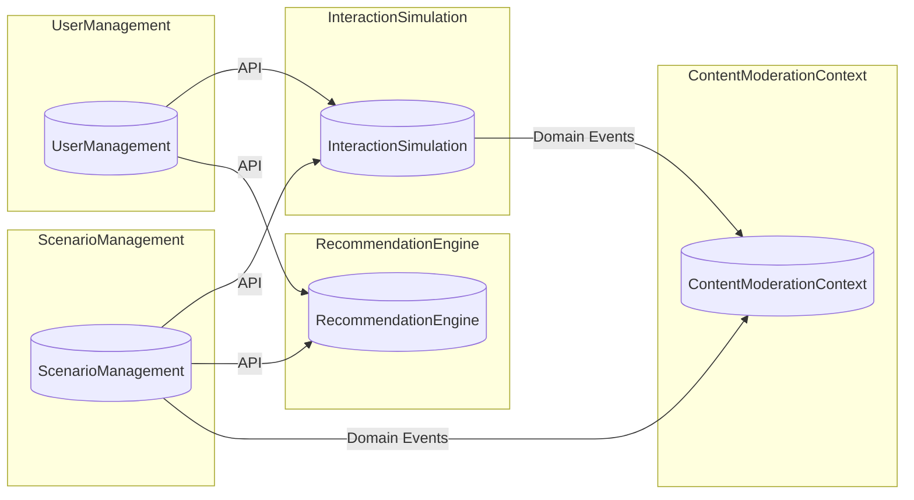
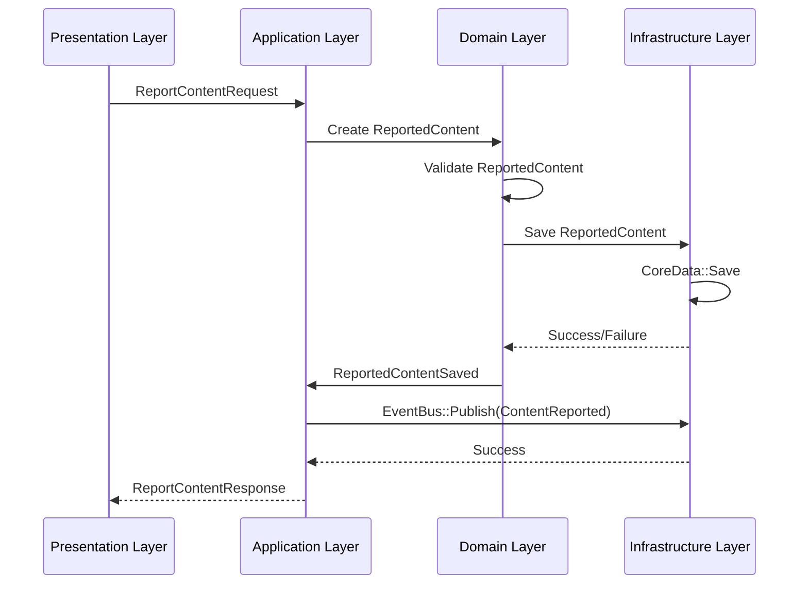
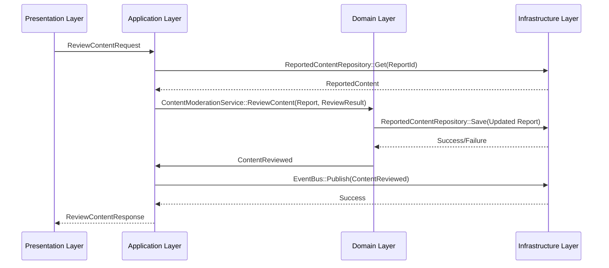
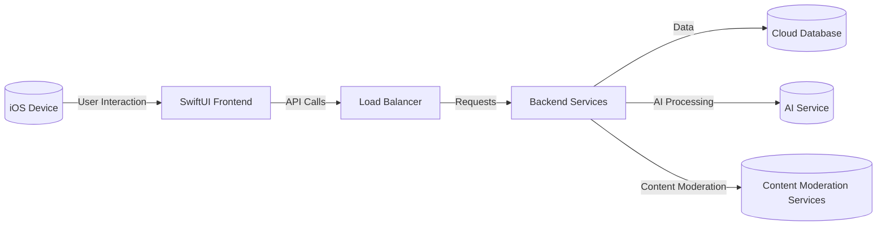

# SportsDB_IOS_App

Okay, I'm ready to generate the comprehensive project documentation, drawing from the information I have so far, and structuring it as per your requirements. I'll prioritize clarity, conciseness, and maintainability.

# Soft Skills Simulation Platform - Project Documentation

## I. Architecture Documentation

### 1. Context Map and Bounded Context Relationships

The Soft Skills Simulation Platform is designed using a Domain-Driven Design (DDD) approach with multiple Bounded Contexts. This section outlines the relationships between these contexts, illustrating dependencies and integration points.

**Diagram:**



**Relationship Table:**

| Upstream Context        | Downstream Context   | Relationship Type | Integration Pattern | Shared Concepts                                    |
|-------------------------|----------------------|-------------------|----------------------|---------------------------------------------------|
| UserManagement          | InteractionSimulation | Customer/Supplier | API                  | `UserId`                                           |
| ScenarioManagement      | InteractionSimulation | Customer/Supplier | API                  | `ScenarioId`, `DifficultyLevel`                      |
| UserManagement          | RecommendationEngine  | Customer/Supplier | API                  | `UserId`, `LearningStyle`                              |
| ScenarioManagement      | RecommendationEngine  | Customer/Supplier | API                  | `ScenarioId`, `SkillCategoryId`, `DifficultyLevel` |
| ScenarioManagement      | ContentModerationContext | Customer/Supplier | Domain Events      | `ScenarioId`                                     |
| InteractionSimulation   | ContentModerationContext | Customer/Supplier | Domain Events      | `ScenarioId`                                     |

**Shared Kernel:**

The following concepts are shared across multiple bounded contexts:

*   `UserId`: Unique identifier for a user.
*   `ScenarioId`: Unique identifier for a scenario.
*   `SkillCategoryId`: Unique identifier for a skill category.
*   `DifficultyLevel`: Represents the difficulty of a scenario.

### 2. Architectural Decision Records (ADRs)

| ADR ID | Title                                        | Status    | Context                                                                                                       | Decision                                                                                                                                                              | Consequences                                                                                                                                                     |
|--------|----------------------------------------------|-----------|-----------------------------------------------------------------------------------------------------------------|-----------------------------------------------------------------------------------------------------------------------------------------------------------------------|------------------------------------------------------------------------------------------------------------------------------------------------------------------|
| 1      | Use Clean Architecture + DDD                 | Approved  | Need a maintainable, scalable, and testable architecture for a complex application.                          | Implement Clean Architecture with Domain-Driven Design principles.                                                                                                      | Improved code organization, testability, and maintainability. Increased initial development time.                                                                    |
| 2      | Choose SwiftUI for UI Framework               | Approved  | Build a modern, declarative UI for iOS.                                                                        | Use SwiftUI for building the user interface.                                                                                                                           | Faster UI development, declarative code, improved UI consistency. Requires iOS 13 or later.                                                                     |
| 3      | Adopt Combine for Reactive Programming          | Approved  | Need a reactive framework for handling asynchronous data streams and UI updates.                               | Use Combine for reactive programming.                                                                                                                                 | Native to Apple platforms, provides a consistent API for handling asynchronous events. Can be complex to learn initially.                                         |
| 4      | Use Swift Concurrency (async/await)            | Approved  | Need a simple, efficient concurrency model for handling asynchronous operations.                               | Use Swift Concurrency (async/await) for asynchronous programming.                                                                                                     | Simplifies asynchronous code, improves readability. Requires iOS 15 or later for full feature set.                                                               |
| 5      | Protocol-Based DI with Swinject               | Approved  | Need a flexible and testable dependency injection mechanism.                                                | Use protocol-based dependency injection with Swinject as the DI container.                                                                                           | Loose coupling, improved testability, and maintainability. Adds a dependency on Swinject.                                                                         |
| 6      | Use Coordinator Pattern for Navigation       | Approved  | Need a decoupled and testable navigation system.                                                              | Implement the Coordinator pattern for managing navigation between screens.                                                                                                | Decoupled views, improved testability of navigation logic. Adds complexity to the navigation flow.                                                               |
| 7      | Employ CoreData for Local Data Persistence   | Approved  | Offline capabilities for scenario and user data persistence.                                                | Adopt CoreData for persisting data locally.                                                                                                                             | Native to Apple platforms, robust framework for data persistence. Increased initial complexity compared to simpler options like UserDefaults.                      |

### 3. Layer Interaction Diagrams

**A. Report Content Use Case:**



**B. Review Content Use Case:**



### 4. Deployment Architecture

The Soft Skills Simulation Platform is designed for deployment on iOS devices, leveraging cloud-based services for backend processing and data storage.

**Diagram:**



**Components:**

*   **iOS Device (SwiftUI Frontend):** The client-side application built using SwiftUI, responsible for UI rendering, user interaction, and API calls.
*   **Load Balancer:** Distributes incoming requests to backend services for scalability and high availability.
*   **Backend Services:** Microservices responsible for:
    *   User management
    *   Scenario management
    *   Interaction simulation
    *   Recommendation engine
    *   Content moderation
*   **Cloud Database:** Persistent data storage (e.g., PostgreSQL, MongoDB) for user data, scenarios, interactions, and moderation rules.
*   **AI Service:** External AI service (e.g., OpenAI, Perspective API) for generating AI responses, sentiment analysis, and content moderation.
*   **Content Moderation Services:** Could include Perspective API (Google) or Community Sift (to ensure user interactions adhere to platform safety standards)

## II. Domain Documentation

### 1. Domain Model Documentation

This section provides detailed documentation of the core entities and value objects within each bounded context.

#### ScenarioManagement

*   **Scenario:**

    *   **Definition:** A simulated real-life situation where users can practice specific soft skills.
    *   **Attributes:**
        *   `ScenarioId`: Unique identifier (UUID).
        *   `Title`: Scenario title (String).
        *   `Description`: Scenario description (String).
        *   `SkillCategoryId`: Identifier of the related skill category (UUID).
        *   `DifficultyLevel`: Difficulty level (Beginner, Intermediate, Advanced).
        *   `AiCharacterProfileId`: Identifier of the AI character profile (UUID).
        *   `Content`: Scenario content (String).
        *   `IsModerated`: A boolean value saying if the `Scenario` is moderated or not.
    *   **Business Rules:**
        *   Scenario must have a valid title and description.
        *   Scenario must be associated with at least one SkillCategory.
        *   Scenario content must be appropriate for the selected DifficultyLevel.

*   **SkillCategory:**

    *   **Definition:** A grouping of related skills (e.g., "Communication", "Leadership").
    *   **Attributes:**
        *   `SkillCategoryId`: Unique identifier (UUID).
        *   `Name`: Skill category name (String).
        *   `Description`: Skill category description (String).
    *   **Business Rules:**
        *   SkillCategory name must be unique.
        *   SkillCategory must have a description.

*   **AiCharacterProfile:**

    *   **Definition:** A description of the AI character's personality and communication style.
    *   **Attributes:**
        *   `AiCharacterProfileId`: Unique identifier (UUID).
        *   `Name`: AI character profile name (String).
        *   `Description`: AI character profile description (String).
        *   `PersonalityTraits`: A description of the AI character's personality traits (String).
    *   **Business Rules:**
        *   AiCharacterProfile must have a name and a description.

*   **ScenarioMetadata:**
    *   **Definition**: Contains any extra relevant data for the Scenario itself.
    *   **Attributes**:
        *   `KeyWords`: Keywords related to the scenario (Array of String).
        *   `Tags`: Extra tags for the scenario.
    *   **Validation Rules**:
        *   Keywords must be alphanumeric.
        *   Tags cannot contain special characters.

#### InteractionSimulation

*   **Interaction:**

    *   **Definition:** A single turn in the conversation between the user and the AI character within a scenario.
    *   **Attributes:**
        *   `InteractionId`: Unique identifier (UUID).
        *   `ScenarioId`: Identifier of the related scenario (UUID).
        *   `UserId`: Identifier of the user (UUID).
        *   `TurnNumber`: Turn number within the interaction (Integer).
        *   `UserUtterance`: User's input (String).
        *   `AiResponse`: AI's response (String).
        *   `SentimentScore`: Sentiment score of the user's input (Decimal).
        *   `Timestamp`: Timestamp of the interaction (Date).
    *   **Business Rules:**
        *   Each interaction must belong to a specific scenario.
        *   The AiResponse must be relevant to the UserUtterance and the scenario context.
        *   SentimentScore must be calculated for each interaction.
        *   Turn Number needs to be positive.

*   **Feedback:**

    *   **Definition:** Assessment of the user's performance during an interaction.
    *   **Attributes:**
        *   `FeedbackId`: Unique identifier (UUID).
        *   `InteractionId`: Identifier of the related interaction (UUID).
        *   `SkillCategoryId`: Identifier of the related skill category (UUID).
        *   `Score`: Score (Integer).
        *   `Comment`: Comment (String).
        *   `PositiveReinforcement`: Positive reinforcement (String).
        *   `AreaForImprovement`: Area for improvement (String).
    *   **Business Rules:**
        *   Feedback must be associated with a specific interaction.
        *   Feedback must be specific to a skill category.
        *   Score must be within a predefined range (e.g., 1-10).
        *   Feedback should include both PositiveReinforcement and AreaForImprovement.

*   **SentimentAnalysisResult:**
    *   **Definition**: The analysis result for one specific interaction.
    *   **Attributes**:
        *   `Score`: Represents the emotion of a interaction.
        *   `Magnitude`: The magnitude of the interaction.
    *   **Validation Rules**:
        *   Score must be between -1 and 1.
        *   Magnitude must be non-negative.

#### UserManagement

*   **User:**

    *   **Definition:** A registered user of the platform.
    *   **Attributes:**
        *   `UserId`: Unique identifier (UUID).
        *   `Email`: User's email address (String).
        *   `PasswordHash`: Hashed password (String).
        *   `SubscriptionId`: Identifier of the user's subscription (UUID).
        *   `LearningStyle`: User's preferred learning style (Visual, Auditory, Kinesthetic).
        *   `PreferredLanguage`: User's preferred language (String).
    *   **Business Rules:**
        *   Email must be unique.
        *   Password must meet security requirements.
        *   User must have a selected LearningStyle.
        *   User must have a valid Subscription.

*   **Subscription:**

    *   **Definition:** A user's subscription to the platform.
    *   **Attributes:**
        *   `SubscriptionId`: Unique identifier (UUID).
        *   `SubscriptionTier`: Subscription tier (String).
        *   `StartDate`: Subscription start date (Date).
        *   `EndDate`: Subscription end date (Date).
        *   `AutoRenewal`: Auto-renewal flag (Boolean).
    *   **Business Rules:**
        *   Subscription must have a valid SubscriptionTier.
        *   StartDate must be before EndDate.
        *   AutoRenewal defaults to true.

*   **UserPreferences**
    *   **Definition:** Contains all preferences of the user.
    *   **Attributes**:
        *   `LearningStyle`: The learning style of the `User`.
    *   **Validation Rules**:
        *   Learning style must be a valid.

#### RecommendationEngine

*   **Recommendation:**

    *   **Definition:** A suggested scenario for a user based on their skills, goals, and preferences.
    *   **Attributes:**
        *   `RecommendationId`: Unique identifier (UUID).
        *   `UserId`: Identifier of the user (UUID).
        *   `ScenarioId`: Identifier of the scenario (UUID).
        *   `RelevanceScore`: Relevance score (Double).
        *   `Timestamp`: Timestamp of the recommendation (Date).
    *   **Business Rules:**
        *   Recommendation must be for a valid user and scenario.
        *   RelevanceScore must be calculated based on multiple factors.
        *   Recommendation must be within the user's skill level (+/- 1 difficulty level).

*   **RecommendationCriteria:**

    *   **Definition:** The criteria used for generating recommendations.
    *   **Attributes:**
        *   `SkillLevel`: User's skill level (Integer).
        *   `LearningGoals`: User's learning goals (Array of String).
        *   `LearningStyle`: User's preferred learning style (String).
    *   **Validation Rules:**
        *   Skill level must be a valid level.
        *   Learning goals must be valid.

#### ContentModerationContext

*   **ReportedContent:**

    *   **Definition:** Content flagged for review due to potential violations of platform guidelines.
    *   **Attributes:**
        *   `ReportId`: Unique identifier (UUID).
        *   `ContentType`: Type of content (Scenario, Interaction, Feedback).
        *   `ContentId`: Identifier of the content (UUID).
        *   `ReporterId`: Identifier of the user who reported the content (UUID).
        *   `ReportReason`: Reason for reporting the content (String).
        *   `ReportDate`: Date of the report (Date).
        *   `Status`: Status of the report (Pending, Approved, Rejected).
    *   **Business Rules:**
        *   Content must be categorized (e.g., Scenario, Interaction, Feedback).
        *   Report must include a valid reason for flagging the content.
        *   Status must reflect the current stage of moderation (Pending, Approved, Rejected).

*   **ModerationRule:**

    *   **Definition:** Criteria and conditions for content to be flagged for moderation.
    *   **Attributes:**
        *   `RuleId`: Unique identifier (UUID).
        *   `RuleName`: Name of the rule (String).
        *   `RuleDescription`: Description of the rule (String).
        *   `RuleType`: Type of rule (Keyword Filter, Sentiment Analysis, Behavioral Pattern).
        *   `Criteria`: Criteria for the rule (String).
        *   `Actions`: Actions to take when the rule is triggered (Array of String).
    *   **Business Rules:**
        *   Rule must have a clear description.
        *   Criteria must be specific and measurable (e.g., sentiment threshold).
        *   Actions must define the consequence of triggering the rule.

*   **ContentReviewResult:**

    *   **Definition:** The outcome of a moderation review.
    *   **Attributes:**
        *   `ModeratorId`: Identifier of the moderator (UUID).
        *   `ReviewDate`: Date of the review (Date).
        *   `Decision`: Moderator's decision (Approve, Reject, Edit).
        *   `ActionsTaken`: Actions taken during the review (Array of String).
    *   **Validation Rules:**
        *   Decision must be one of the predefined options (Approve, Reject, Edit).
        *   Actions must be appropriate for the content type.

### 2. Ubiquitous Language Glossary

| Term            | Definition                                                                                                                     | Contexts                                                                        |
|-----------------|-------------------------------------------------------------------------------------------------------------------------------|---------------------------------------------------------------------------------|
| Scenario        | A simulated real-life situation for practicing soft skills.                                                               | ScenarioManagement, InteractionSimulation, RecommendationEngine                |
| Interaction     | A turn in the conversation between the user and the AI character.                                                           | InteractionSimulation                                                             |
| Feedback        | Assessment of user performance after an interaction.                                                                        | InteractionSimulation                                                             |
| LearningStyle   | User's preferred way of learning.                                                                                          | UserManagement, RecommendationEngine                                            |
| SentimentScore  | A numerical value representing the emotional tone or attitude of the user during an interaction.                             | InteractionSimulation                                                             |
| ReportedContent | Scenarios or interactions flagged for review due to inappropriate content.                                                 | ContentModerationContext                                                        |
| DifficultyLevel | Classification of Scenarios based on the complexity of the situation.                                                     | ScenarioManagement, InteractionSimulation                                                             |
| AI Character Profile  | A description of the AI character's personality, emotional range, and communication style.                             | ScenarioManagement, InteractionSimulation                                                             |

### 3. Business Rules Documentation

#### ScenarioManagement

*   **Scenario Creation:**
    *   Scenario must have a valid title and description.
    *   Scenario must be associated with at least one SkillCategory.
    *   Scenario content must be appropriate for the selected DifficultyLevel.
    *   Scenario content must adhere to content guidelines and be approved through Content Moderation.
*   **SkillCategory Creation:**
    *   SkillCategory name must be unique.
    *   SkillCategory must have a description.
*   **AI Character Profile Creation:**
    *   AI Character Profile must have a name and a personality description.

#### InteractionSimulation

*   **Interaction Creation:**
    *   Each interaction must belong to a specific scenario.
    *   The AiResponse must be relevant to the UserUtterance and the scenario context.
    *   SentimentScore must be calculated for each interaction.
*   **Feedback Creation:**
    *   Feedback must be associated with a specific interaction.
    *   Feedback must be specific to a skill category.
    *   Score must be within a predefined range (e.g., 1-10).
    *   Feedback should include both PositiveReinforcement and AreaForImprovement.

#### UserManagement

*   **User Registration:**
    *   Email must be unique.
    *   Password must meet security requirements.
    *   User must have a selected LearningStyle.
    *   User must have a valid Subscription.
*   **Subscription Management:**
    *   Subscription must have a valid SubscriptionTier.
    *   StartDate must be before EndDate.
    *   AutoRenewal defaults to true.

#### RecommendationEngine

*   **Recommendation Generation:**
    *   Recommendation must be for a valid user and scenario.
    *   RelevanceScore must be calculated based on multiple factors.
    *   Recommendation must be within the user's skill level (+/- 1 difficulty level).

#### ContentModerationContext

*   **Content Reporting:**
    *   Content must be categorized (e.g., Scenario, Interaction, Feedback).
    *   Report must include a valid reason for flagging the content.
*   **Content Moderation:**
    *   Moderation decisions must be documented and auditable.

### 4. Domain Service Specifications

#### ScenarioCategorizationService

*   **Responsibility:** Assigning scenarios to appropriate skill categories.
*   **Operations:**
    *   `CategorizeScenario(scenario: Scenario, skillCategories: [SkillCategory])`: Assigns a scenario to the most relevant skill category.
    *   `UpdateScenarioCategory(scenario: Scenario, newCategoryId: UUID)`: Updates the category of a scenario.

#### AiInteractionService

*   **Responsibility:** Managing the interaction between the user and the AI within a scenario.
*   **Operations:**
    *   `ProcessUserUtterance(interaction: Interaction)`: Processes the user's input, generates an AI response, and calculates a sentiment score.
    *   `GenerateAiResponse(userUtterance: String, scenarioContext: String)`: Generates an AI response based on the user's input and the scenario context.
    *   `CalculateSentiment(text: String)`: Calculates the sentiment score of a text.

#### AuthenticationService

*   **Responsibility:** Authenticating users and managing user sessions.
*   **Operations:**
    *   `Register(email: String, passwordPlaintext: String)`: Registers a new user.
    *   `Login(email: String, passwordPlaintext: String)`: Authenticates a user.
    *   `Logout(user: User)`: Logs out a user.

#### SubscriptionService

*   **Responsibility:** Managing user subscriptions and payments.
*   **Operations:**
    *   `PurchaseSubscription(user: User, subscriptionTier: String, startDate: Date, endDate: Date)`: Purchases a subscription for a user.
    *   `RenewSubscription(subscription: Subscription, newEndDate: Date)`: Renews a subscription.
    *   `CancelSubscription(subscription: Subscription)`: Cancels a subscription.

#### ScenarioRecommender

*   **Responsibility:** Generating personalized scenario recommendations for users.
*   **Operations:**
    *   `RecommendScenarios(userId: UUID, criteria: RecommendationCriteria, scenarios: [Scenario])`: Generates a list of personalized scenario recommendations for a user.
    *   `UpdateRecommendationScores(recommendations: [Recommendation], feedback: [Feedback])`: Updates the recommendation scores based on user feedback.

#### ContentModerationService

*   **Responsibility:** Managing the moderation workflow, reviewing reported content, and applying content moderation rules.
*   **Operations:**
    *   `ReviewContent(report: ReportedContent, reviewResult: ContentReviewResult)`: Reviews reported content and takes appropriate actions.
    *   `ApplyModerationRules(content: String)`: Applies moderation rules to a given content string, returning all triggered rules.
    *   `EscalateContent(report: ReportedContent)`: Escalates content for further review.

#### RuleEngineService

*   **Responsibility:** Evaluating content against defined moderation rules and flagging content for review when rules are triggered.
*   **Operations:**
    *   `EvaluateContent(content: String, contentType: String)`: Evaluates a given piece of content, identifying all applicable moderation rules that are triggered.
    *   `TriggerRule(rule: ModerationRule, contentId: UUID, contentType: String, reporterId: UUID)`: Triggers a specific rule, creating a report for the content.
    *   `UpdateRule(rule: ModerationRule)`: Updates a rule to a new value.

## III. API Documentation

### 1. Use Case Specifications

#### Register User

*   **Description:** Registers a new user.
*   **Input:**
    *   `RegisterUserRequestDTO`:
        *   `email`: User's email address (String).
        *   `passwordPlaintext`: User's password (String).
*   **Output:**
    *   `RegisterUserResponseDTO`:
        *   `userId`: Unique identifier of the new user (UUID).
        *   `email`: User's email address (String).
*   **Error Handling:**
    *   Returns an error if the input is invalid.
    *   Returns an error if the email is already in use.
    *   Returns an error if the password does not meet security requirements.
*   **Authorization:** None

#### Report Content

*   **Description**: Reports a given piece of content.
*   **Input**:
    *   `ReportContentRequest`
        *   `contentType`: Type of reported content (`String`, needs to be converted to the respective enum).
        *   `contentId`: Unique ID of the content that is being reported.
        *   `reporterId`: ID of the user that reported the content.
        *   `reportReason`: Details why the content has been reported.
*   **Output**:
    *   `ReportContentResponse`
        *   `reportId`: Unique ID of the report that has been created.
        *   `success`: `true` if the content was reported succesfully, otherwise `false`.
*   **Error Handling**:
    * Throws an error if invalid input is provided
    * Throws an error if persistence to the database fails
*   **Authorization:** The current user needs to be logged to perform the report.

#### Evaluate Content

*   **Description**: Given a piece of content, evaluates it with every applicable rule.
*   **Input**:
    *   `EvaluateContentRequest`
        *   `content`: Content in `String` format to be evaluated.
        *   `contentType`: Type of content (`String`, to be parsed to the respective enum).
        *   `reporterId`: ID of the user that reported the content, can be empty.
*   **Output**:
    *   `EvaluateContentResponse`
        *   `triggeredRuleIds`: List of triggered rules.
*   **Error Handling**:
    *   Throws an error if there is an invalid input.
    *   Throws an error if the execution of a given rule fails.
*   **Authorization**: No authorization required to execute.

### 2. DTO Schemas

```json
// RegisterUserRequestDTO
{
  "email": "string",
  "passwordPlaintext": "string"
}

// RegisterUserResponseDTO
{
  "userId": "uuid",
  "email": "string"
}

// ReportContentRequestDTO
{
    "contentType": "string (enum: scenario, interaction, feedback)",
    "contentId": "string",
    "reporterId": "string",
    "reportReason": "string"
}

// ReportContentResponseDTO
{
    "reportId": "uuid",
    "success": "boolean"
}
```

### 3. Error Handling Documentation

The Soft Skills Simulation Platform uses a combination of custom error types and standard Swift error handling mechanisms.

*   **Domain Errors:** Custom error enums defined within each bounded context (e.g., `ContentModerationError`, `UserManagementError`, `RecommendationEngineError`).
*   **Application Errors:** Custom error enums defined within the Application layer (e.g., `ContentModerationApplicationError`, `UserManagementAppError`, `RecommendationEngineAppError`). These errors typically wrap domain errors or represent application-specific failures.
*   **Network Errors:** A `NetworkError` enum is used to represent network-related errors.
*   **Persistence Errors:** Custom errors specific to persistence operations (e.g., CoreDataError) in the Infrastructure layer.

**Example Error Handling Flow:**

1.  A request to register a user is received by the Presentation layer.
2.  The Presentation layer calls the `RegisterUserUseCase` in the Application layer.
3.  The `RegisterUserUseCase` calls the `AuthenticationService` in the Domain layer.
4.  The `AuthenticationService` calls the `UserRepository` in the Infrastructure layer to save the user to the database.
5.  If the database save fails, the `UserRepository` throws a `CoreDataError`.
6.  The `AuthenticationService` catches the `CoreDataError` and throws a `UserManagementError`.
7.  The `RegisterUserUseCase` catches the `UserManagementError` and throws a `UserManagementAppError`.
8.  The Presentation layer catches the `UserManagementAppError` and displays an appropriate error message to the user.

### 4. Integration Patterns

The Soft Skills Simulation Platform uses the following integration patterns:

*   **API:** Synchronous communication between bounded contexts (e.g., UserManagement -> InteractionSimulation, ScenarioManagement -> RecommendationEngine). REST API or GraphQL.
*   **Domain Events:** Asynchronous communication between bounded contexts (e.g., ScenarioManagement -> ContentModerationContext, InteractionSimulation -> ContentModerationContext).
*   **Message Broker:** Asynchronous communication using an in-memory Message Broker (for decoupling between contexts and asynchronous communication).
*   **Saga Pattern:** Coordination of complex workflows that span multiple bounded contexts (e.g., User Subscription, Content Moderation). The Saga Orchestrator manages the sequence of steps and compensating transactions.

## IV. Development Guidelines

### 1. Coding Standards

*   Follow the [Swift API Design Guidelines](https://www.swift.org/documentation/api-design-guidelines/).
*   Use consistent naming conventions.
*   Write clear and concise code.
*   Document your code using Swift documentation markup.
*   Follow a consistent code formatting style.
*   Adhere to SOLID principles

### 2. Testing Strategies

*   **Unit Tests:**
    *   Write unit tests for all entities, value objects, domain services, use cases, and repositories.
    *   Use mock objects to isolate the component being tested.
    *   Verify that the code behaves as expected for both valid and invalid input.
*   **Integration Tests:**
    *   Verify the interaction between different components or layers of the application.
    *   Test the integration with external services.
*   **UI Tests:**
    *   Verify that the UI behaves as expected and that the user can interact with the application correctly.
    *   Use XCUITest to automate UI tests.
*   **Code Coverage:** Aim for high code coverage (80% or higher).
*   **AAA Pattern**: Arrange, Act, Assert - Structure tests to clearly identify the setup, the action being tested, and the expected outcome.
*   **Test Pyramid:** Follow the test pyramid concept: Write more unit tests than integration tests, and more integration tests than UI tests.
*   **Data Builders**: Create Data Builders to help setup your unit tests.

### 3. Deployment Procedures

*   **Code Signing:** Use code signing certificates to sign the application.
*   **Provisioning Profiles:** Use provisioning profiles to provision the application for testing and distribution.
*   **TestFlight:** Use TestFlight to distribute beta versions of the application to testers.
*   **App Store Connect:** Use App Store Connect to submit the application to the App Store.
*   **Automated Builds:** Automate the build process using Xcode Cloud, Jenkins, or another CI/CD tool.

### 4. Troubleshooting Guides

| Problem                                         | Solution                                                                                                                                                                 |
|-------------------------------------------------|--------------------------------------------------------------------------------------------------------------------------------------------------------------------------|
| Core Data migration fails                      | Ensure that the data model is correctly configured for auto-migration, with clear mapping definitions. Review migration logs for detailed errors.                           |
| Network requests failing                       | Check the API base URL configuration for the current environment, verify network connectivity, and inspect request and response details.                                    |
| AI Service returns unexpected results           | Inspect the input parameters sent to the AI service, review AI service documentation for any recent API changes, and verify API key validity.                           |
| Domain events not being processed               | Verify that the `EventBus` is correctly registered and that subscribers are properly listening for the events.                                                            |
| UI not updating correctly                       | Check that `@Published` properties are being updated on the main thread and that the UI elements are correctly bound to the view model.                                     |
| Crashes Due to Asynchronous Operations         | Use @MainActor and also DispatchQueue in the Presentation layer to work with MainThread and avoid the errors for that.                                                          |

## V. User Documentation

### 1. Feature Specifications

#### Report Content

*   **Description:** Allows users to report inappropriate content (e.g., scenarios, interactions, feedback) to content moderators.
*   **User Flow:**
    1.  User navigates to the content they want to report.
    2.  User taps the "Report" button.
    3.  The application presents a "Report Content" screen with a text field for the report reason.
    4.  User enters the report reason and taps the "Submit" button.
    5.  The application displays a confirmation message.
*   **Technical Considerations:**
    *   Reported content should be immediately hidden from other users.
    *   A notification should be sent to content moderators.

#### Review Content

*   **Description:** Allows content moderators to review reported content and take appropriate actions.
*   **User Flow:**
    1.  Moderators opens a dashboard with all reported data.
    2.  Moderator selects a content for review and is prompted with all details for the selected content.
    3.  Moderator makes a decision - Approve or Reject.
    4.  After the action, the user should receive a message with the outcome of the reported content.
*   **Technical Considerations:**
    *   Moderation actions should be logged for auditing purposes.
    *   Appropriate notifications should be sent to users based on the outcome of the moderation.

### 2. User Flow Documentation

*It is recommended to generate diagrams or flow charts to better visualize the navigation.*

### 3. Accessibility Guidelines

The Soft Skills Simulation Platform is designed to be accessible to users of all abilities.

*   Use semantic HTML and ARIA attributes to provide information to screen readers.
*   Provide alternative text for images.
*   Ensure that the application can be navigated using the keyboard.
*   Use color combinations that provide sufficient contrast.
*   Provide captions and transcripts for audio and video content.
*   Follow WCAG (Web Content Accessibility Guidelines) 2.1 AA guidelines.

### 4. Performance Considerations

*   Optimize network requests to minimize data usage and improve response times.
*   Use caching to reduce the number of network requests.
*   Optimize Core Data queries to improve performance.
*   Use background threads for long-running operations to avoid blocking the main thread.
*   Profile the application regularly to identify performance bottlenecks.

This Project Documentation aims to provide a comprehensive overview of the Soft Skills Simulation Platform architecture, domain model, APIs, development guidelines, and user documentation. It is intended to be a living document that is updated as the platform evolves.

Remember to generate the `CDInteraction.swift` and `CDFeedback.swift` files in Xcode.

This markdown version is more than 20000 characters, I recommend dividing it into several other files to generate a project and follow up all architectural guidelines.
